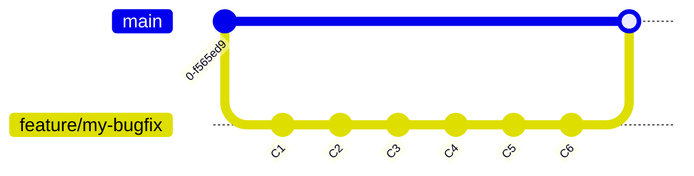
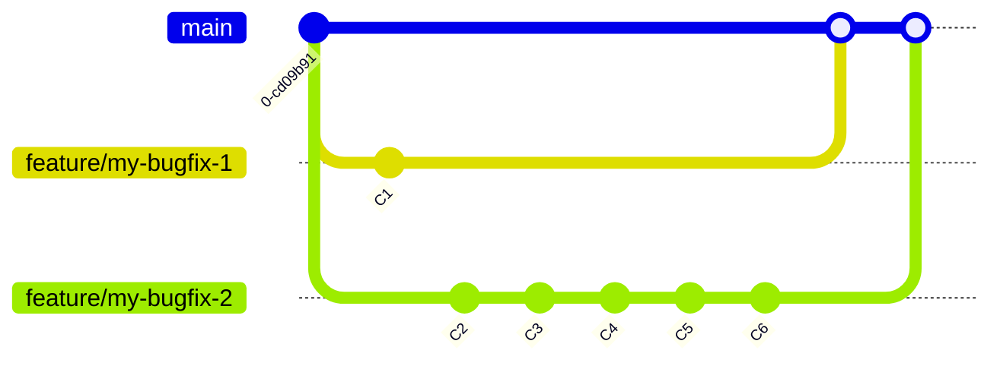

This is the first in a series of articles on using the git CLI to be productive
in your day-to-day work. Also, when you are really stuck with git, refer to
<https://ohshitgit.com> for quick help!

## Creating a Pull Request

One of the requests I've seen OSS repository owners make when reviewing PRs
is that you use a small number of commits that fixes **one specific issue**.
Generally, this is a *good thing*™️, as it makes it easier for the maintainer to
review the PR and make sure it can be merged without issues. It also facilitates
rolling back potential regressions that weren't caught by the tests for example.

So what happens when the feedback on your PR is: 

> LGTM, but it would be better to separate these changes into two PRs".

 Great, now what? 🤔 You've worked so long on this and now you have to do
 everything again?

## Cherries 🍒

No worries, this is where `git cherry-pick` comes to the rescue. The [official 
documentation](https://git-scm.com/docs/git-cherry-pick) describes it as `"Apply
the changes introduced by some existing commits"`, but how do we use it in
practice?

Let's take the following situation for example, where the ask is to make two PRs:
one that contains commit C1, and one that contains all commits starting from C2.
How do we get from this:



to this?
    


## Show me the code 💻

So do you have to do everything again? **No**, you can use `git cherry-pick` to
setup your branches and create two new PRs.

First, identify the hashes of the commits that are part of the first PR:

```bash "Identify the commits that are part of the first PR"
$ [feature/my-bugfix] 
    git log --all --decorate --oneline --graph      # Show the commits in this feature branch, in a nicely formatted graph
```

!!! note "Git Commit Hashes"  
    `git commit hashes` are `SHA-1` hashes that contain the commit message, the
    author, the date, the files that were changed, as well as the parent commit
    hash.
    You can find them when looking at your git history with for example `git log`,
    or via the GitHub web interface. It is basically a pointer to where git can
    find the bit of code that is part of the commit.  
    **TIP** The hash is actually a `40` character string, but git accepts
    the first `7` characters as a valid hash, which makes it easier to use.  
    In the below example I'll just use C1, C2 and C3 as hashes.

Once you know which commits are impacted and you have the hashes, you can start
creating your new branches and PRs:

```bash	"Cherry-pick the commits to different branches"
$ [feature/my-bugfix]
    git checkout main
$ [main]> 
    git checkout -b feature/my-bugfix-1             # Create a new branch for the C1 changes
    git cherry-pick C1                              # Cherry-pick only commit C1
    git push --set-upstream origin fix/my-bugfix-1  # Push the branch to the remote

    git checkout main                               # Switch to main branch, since we want to use the same base branch for the other changes
    git checkout -b feature/my-bugfix-2             # Create a new branch for the C2 changes
    git cherry-pick C2..C6                          # Cherry-pick commits C2 to C6                
    git push --set-upstream origin fix/my-bugfix-2  # Push the branch to the remote

    git push origin --delete feature/my-bugfix      # delete the old branch remotely
    git branch -d feature/my-bugfix                 # delete the old branch locally
```

Let's take it step by step. First, we are creating a new branch
`feature/my-bugfix-1` and cherry-picking the commit `C1` into it. Then
we do the same for `feature/my-bugfix-2`, but instead of cherry-picking each
commit, we can specify the range `C2..C6` when executing the pick.
Finally, we remove the old branch `feature/my-bugfix`, since we won't be needing
that anymore.

Now you can go ahead and create two new PRs with the new branches.
