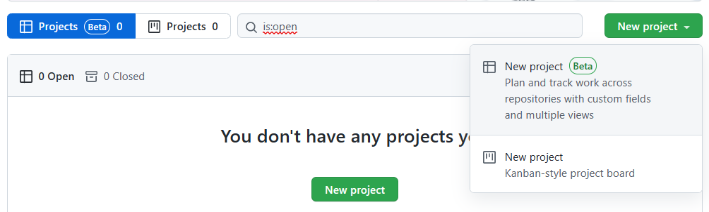
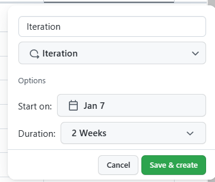
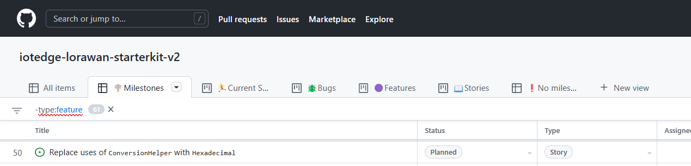
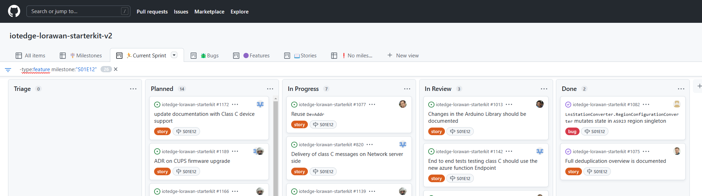
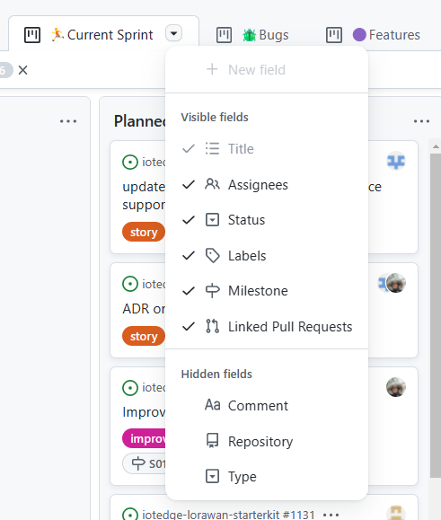
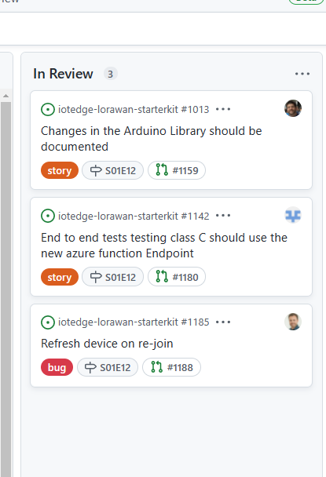
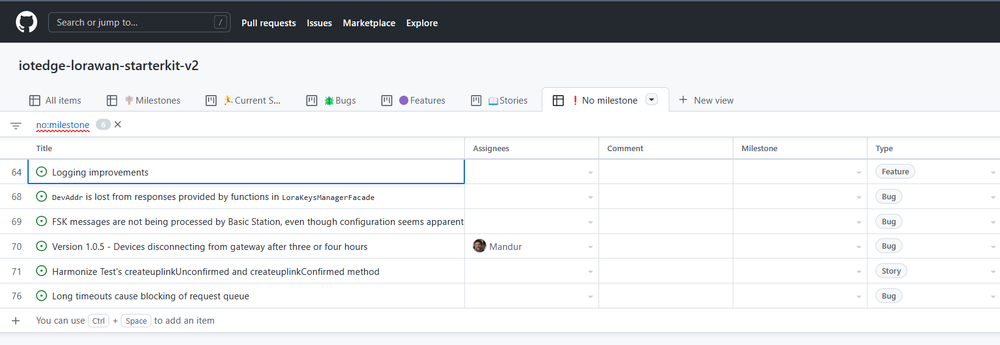

The new GitHub Projects experience is in [public beta](https://docs.github.com/en/issues/trying-out-the-new-projects-experience)
for everyone to enjoy and use. You should be able to go ahead and create a new
project:

## Using it on a real project

Currently, I'm working a with a [CSE DevCrew](https://devblogs.microsoft.com/cse/)
on a public OSS project called [IoTEdge LoRaWAN StarterKit](https://github.com/Azure/iotedge-lorawan-starterkit).
We were using "classic" GitHub projects in the past, but we've now moved to using
the new beta experience. It's been a very great experience so far, and it is slowly
becoming a contender for AzureDevOps Boards or Jira.

I'll list a few tips and tricks, as well as shortcomings and caveats, to learn
how you could use this on your own projects.

## Creating a Product Backlog

We created a Milestone to capture our Product Backlog (in our case, this is more
an Engagement Backlog), which we called aptly `January 2022`. I added all the
items from this Milestone to the board, and got started with arranging the board
to fit the daily needs of the team:

- a quick overview of what is in scope
- a board to manage the current sprint
- a board to triage new items during the daily

### Issue Hierarchy

GitHub Issues have built-in support to track issues in other issues; in other words,
it allows you to use some form of hierarchy in your items, the same as for example
ADO or Jira would allow you to do. We choose to keep it simple and have 4 issue types:
**Epic**, **Feature**, **Story** and **Bug**. We use labels to mark the issues,
and I've created a custom field on the board called `Type` to be able to group-by
and filter the issues on that field.

!!! note Tip
    When adding an item, you can automatically set the `Type` if you add the issue
    in the correct group.

!!! note "A note on Sprints"

    { align=right width="200" }
    We use Milestones to manage our sprints, and create a milestone for each sprint
    (typically a week in length). There is also the possibility to create a custom
    field for "Iteration", but we decided not to use it. The milestones allow us to
    have a decent history of what issues we tackeld when, and there is a PowerBI
    report that uses it to report the progress (more on that in a next post? Let me
    know in the comments if you're interested).

## Different Views

Different stackeholders of a project require different views on progress and
status. That's why we ended up using these views:

- **All Items**: overview of all items in the Product Backlog - grouped by issue type
- 🪧**Milestones**: overview of issues grouped by milestone
- 🏃**Current Sprint**: Board of issues in the current sprint
- 🪲**Bugs**: Board for triaging Bugs
- 🟣**Features**: Board of Features for a high level overview
- 📖**Stories**: Board of Stories
- ❗**No Milestone**: Used for triaging new issues

Most of them are pretty straight-forward, but I'll dive in to a few things here:

### Current Sprint

During the daily, the scrum lead uses this board to show an overview on how we are
doing in the current sprint. Remember, a sprint is a milestone in our case, so
I used the filter functionality to show only stories and bugs for the current
milestone: `-type:feature milestone:<name-of-your-milestone>`. More on the filter
syntax can be found in the [GitHub Docs](https://docs.github.com/en/search-github/searching-on-github/searching-issues-and-pull-requests)

!!! warning "Milestone names"
    We tend to use extensive names for our milestones, and they usually have a
    nice emoji as well. If you do this, you'll need to include that specific emoji
    in the search field! For example: `milestone:"my great milestone 🙈"`

#### Configuration

To make this board useful, I made sure all the relevant information is shown on
each card, such as Linked Pull Request, Assignee and Labels

{ width="350"}
{ align=right width="250"}

### No Milestone

As mentioned before, this board is used for triaging new issues. As part of the
process, when someone creates an issue they will add it to the board, but *not*
set a milestone. This results in the status being set to *Triage* and it will
show up on this board. We then discuss each issue in the daily, and choose to
assign it to either the Current Sprint, the Product Backlog or the VNext milestone.

## What is missing

You might say "🤔 *this is great and all that, but I am missing feature X and Y and 
I will keep using Jira/AzureDevOps/Zendesk/.."*, and you may be right. There are
definitely some things missing for a true project management solution,
but it is more than good enough for running short projects. Nevertheless, here
are a some things that I didn't like, or would love to see added in the future:

- **Automatically add new issues to a board**: currently this is only possible with
external GitHub Apps. It would be great to be able to set this in the [Issue Template](https://docs.github.com/en/communities/using-templates-to-encourage-useful-issues-and-pull-requests)
- **Ability to add multiple issues at once**: there is no way to add a bunch of
issues to the board at once, either via a query or multi-select + action dropdown.
(For example, this is possible for milestones, directly from the "Issues" view)
- **Rules**: I'd love to be able to set Rules for each column on the boards, for example:
    - An items cannot be `In Progress` without having a milestone
    - Limit number of items in a column
- **Visualize Hierarchy**: there is no way to visuaize the full hierarchy of an
Epic for example. I'd love to be able to see all Features under an Epic, and all
Stories under a Feature, in one glance.

## Conclusion

Go ahead and play around with these new GitHub Boards, and let me know what you
think!